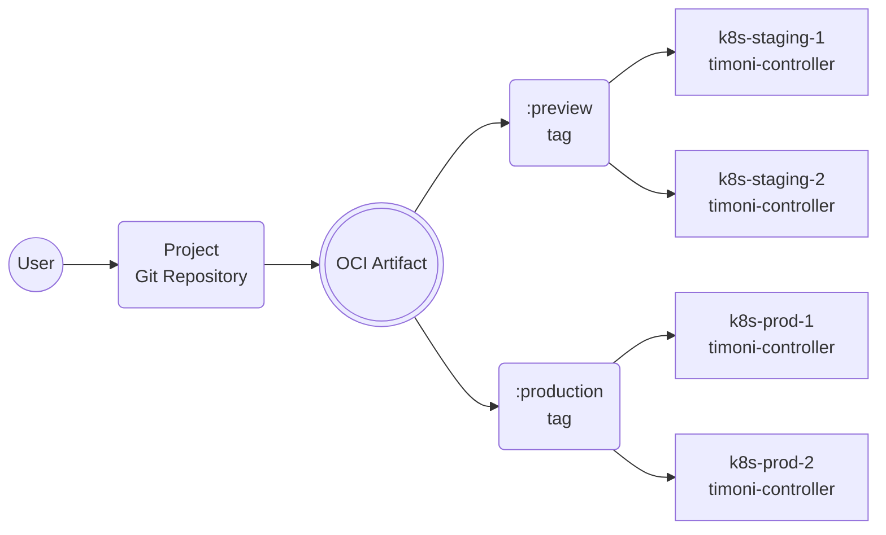
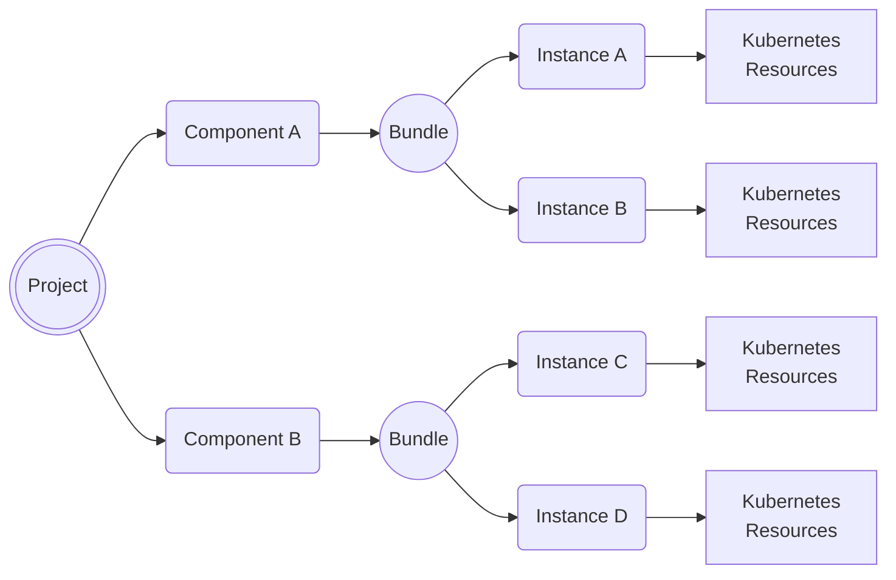

# [RFC] Timoni Controller

## Controller overview

The Timoni controller is a Kubernetes operator that manages the lifecycle
of applications packaged as Timoni Modules and configured with Timoni Bundles.

The controller is responsible for reconciling the application's
desired state with the actual state of the Kubernetes cluster. The controller
performs the same operations as the Timoni CLI, but in a declarative way and
fully autonomous. Its main purpose is to automate the deployment of applications
across fleets of Kubernetes clusters without the need for human intervention.

The Timoni controller subscribes to the [GitOps principles](https://opengitops.dev/),
but instead of relying on Git as the source of truth, it uses container registries
and OCI artifacts. To make use of the controller in a GitOps fashion, a CI pipeline
is needed to publish the desired state definitions from the Git repo to a container registry.

The controller comes with a Kubernetes custom resource definition (CRD) called **Project**.
The Project custom resources are used to point the controller to the OCI artifacts that contain
the cluster desired state. All the actions performed by the controller are logged as Kubernetes
events and are reflected in the Project's status.

The controller has the capability to configure the managed applications using dynamic values
extracted from the live cluster. Thus reducing the verbosity of the apps definitions
and enabling a better separation of concerns between the application developers and the cluster operators.

## Project specifications

A Timoni Project is a collection of Bundles that are automatically deployed to a fleet of Kubernetes clusters.
The Project's source code can be versioned in a Git repository and must be published to a container registry.

Clusters that are running the Timoni controller can subscribe to a Project using a Kubernetes custom resource
that contains the Project's container registry URL and the artifact tag.



A Timoni Project is a self-contained unit that describes how one or more applications
are configured and deployed to each Kubernetes cluster or group of clusters. Changes to an application's
configuration, that are published to a container registry, will be automatically applied to the target clusters.
Promoting changes from one environment to another can be done by tagging an artifact digest with a tag name
watched by a group of clusters.

### Project custom resource

The Project's custom resource role is to point the controller to the Project's OCI repository.
And to assign a Kubernetes Service Account that the controller will use to perform
operations on the cluster when reconciling the Project's components.

After creation, the Project's custom resource `.spec` is considered immutable.
Changes to the Project's components can be made by updating the Project's source code,
the custom resource is merely a pointer to the Project's OCI artifact.

Example:

```yaml
apiVersion: projects.timoni.sh/v1alpha1
kind: Project
metadata:
  name: my-project
  namespace: my-project-ns
  annotations:
    runtime.timoni.sh/cluster: "k8s-prod-1"
    runtime.timoni.sh/group: "production"
spec:
  serviceAccountName: "my-project-sa" # optional, defaults to the project name
  source:
    repository: "oci://my-registry/my-project" # required
    tag: "production" # optional, defaults to "latest"
    path: "project.cue" # optional, defaults to "project.cue"
```

The `.spec.serviceAccountName` has a dual purpose:

- It is used to attach image pull secrets for the Project's repository and for all the modules' repositories.
- It is used for impersonation by the controller to perform operations on the cluster, thus ensuring tenant isolation.

The `.spec.source` is used to fetch the OCI artifact from the container registry that contains
the Project's CUE definition and all the bundle and runtime files referenced by it.

The `runtime.timoni.sh` annotations can be used to set runtime values that are automatically injected
into the Project's bundles. Thus enabling the Project's source code to target multiple clusters while
using different values for each cluster.

### Project structure

The Project's source code can be versioned in a Git repository and can be structured in various ways.

Example:

```sh
├── my-app
│   ├── bundle.cue 
│   └── runtime.cue
├── my-infra
│   ├── bundle.cue 
│   └── runtime.cue
└── project.cue
```

Multiple Projects can be stored in the same repository, and each Project can
be deployed to multiple clusters.
For each target cluster, the Project's bundles can contain different config values
specific to that cluster or to its group of clusters.
The runtime definitions allow bundles to use dynamic config values extracted from
the target cluster, such as exiting Secrets, ConfigMaps and even custom resources.

### Project definition

The Project's CUE definition contains a list of components that point to the Bundle and Runtime files.

Example:

```cue
project: {
	apiVersion: "v1alpha1"
	name:       "my-project"
	components: {
		"my-app": {
			bundle: ["./my-app/bundle.cue"]
			runtime: ["./my-app/runtime.cue"]
			needs: ["my-infra"]
		}
		"my-infra": {
			bundle: ["./my-infra/bundle.cue"]
			wait:    true
			timeout: "5m"
		}
	}
}
```

The controller will reconcile the Project's components by applying
the Bundles using their corresponding Runtime definitions.
By default, the controller will reconcile the components in parallel.
The `needs` field can be used to define dependencies between components
and thus control the order in which the bundles are applied.

The `wait` field can be used to instruct the controller to wait for all applied resources
to become ready. The controller will monitor the rollout of Kubernetes Deployments,
StatefulSets, DaemonSets, Jobs and custom resources and will wait for all the rollout
to finish before reconciling the dependent components.

The `timeout` field can be used to set a timeout for the reconciliation of a component
including the wait time for all resources to become ready.

The `runtime` field is optional, when not specified, the controller will
inject the annotations values from the Project's custom resource into the Bundle.

Example of a Bundle that uses the annotations values from the Project's custom resource:

```cue
bundle: {
	_cluster: {
		name:  string @timoni(runtime:string:TIMONI_CLUSTER_NAME)
		group: string @timoni(runtime:string:TIMONI_CLUSTER_GROUP)
	}

	apiVersion: "v1alpha1"
	name:       "my-app"
	instances: {
		podinfo: {
			module: url: "oci://ghcr.io/stefanprodan/modules/podinfo"
			namespace: "my-project-ns"
			values: {
				if _cluster.group == "staging" {
					replicas: 1
				}
				if _cluster.group == "production" {
					replicas: 2
				}
			}
		}
	}
}

```

### Project publishing

The contents of the Git repository can be packaged as an OCI artifact and pushed to a container registry
using the `timoni artifact push` command. From there, the controller(s) will fetch the artifact and
deploy the Project to cluster(s).

Example:

```shell
timoni artifact push oci://my-registry/my-project \
  --tag=1.0.0 \
  --tag=staging
```

The push operation can be performed by a CI pipeline when a change is committed to the Git repository.

It is recommended to set an immutable tag that denotes the Git revision of the Project's source code.
The revision tag can be semver or a Git commit SHA or any other format that contains a unique identifier.

Mutable tags can be used to set the target group of clusters where a particular Project revision will be deployed.

Example of promoting a Project revision to production:

```shell
timoni artifact tag oci://my-registry/my-project:1.0.0 \
  --tag=production
```

### Project bootstrap

To streamline the onboarding of Projects onto Kubernetes clusters,
the Timoni CLI provides a `timoni project bootstrap` command.

Example:

```shell
timoni project bootstrap my-project \
  --cluster-name k8s-prod-1 \
  --cluster-group production \
  --namespace my-project-ns \
  --service-account my-project-sa \
  --service-account-role admin \
  --repository oci://my-registry/my-project \
  --repository-creds $DOCKER_USER:$DOCKER_TOKEN \
  --tag production
```

If the target cluster is not running the Timoni controller, the bootstrap command will
prompt the user to confirm the installation of the controller in the `timoni-system` namespace.

The bootstrap command will create the Project's namespace, image pull secret, custom resource,
service account and role binding.

If the Project's service account role is set to `admin`, this will grant the SA admin privileges
only in the Project's namespace. If the Project's service account role is set to `cluster-admin`,
this will grant the SA admin privileges in the entire cluster.

Installing the Timoni controller and bootstrapping Projects across multiple clusters
can also be accomplished with a Timoni Bundle or with a GitOps tool.

### Project reconciliation

The reconciliation of a Project consists of the following operations:

- Reads the image pull secrets attached to the Project's service account.
- Connects to the container registry using the credentials from the image pull secrets.
- If no secrets are found, the controller will use Kubernetes Workload Identity
  to authenticate to the container registry.
- Fetches the artifact metadata (OCI manifest) for the specified tag from the container registry.
- Downloads the OCI artifact layers if they are not already cached.
- Extracts the OCI artifact contents to a temporary directory.
- Reads the Project's CUE definition and validates the files referenced by each component.
- Determines the parallelization factor and the order in which the components will be reconciled.
- Starts the reconciliation of each component in parallel.
- When all components are reconciled, an event is emitted, and the Project's Status is updated to reflect
  the overall result.



The reconciliation of a component consists of the following operations:

- Loads the values from the Runtime definitions and injects them into the Bundle.
- Downloads (if not cached) the Modules referenced by the Bundle using
  the image pull secrets to authenticate to the container registry.
- Applies the Bundle's Instances in order one-by-one.
- Waits for each Instance to be rolled out and healthy before applying the next Instance.
- If the reconciliation fails, the controller will retry the operation using a configurable exponential backoff.
- When an Instance apply finishes, a Kubernetes event is emitted. The event contains the list of
  applied resources, the error message if the Instance apply failed, the module version,
  and the time it took to apply the Instance.
- When the component reconciliation finishes, it's status is reflected in the Project's Status.

### Project commands

The Timoni CLI provides a set of commands to help manage and inspect Projects.

#### Lifecycle

- `timoni project bootstrap` - bootstraps a Project onto a Kubernetes cluster.
- `timoni project delete` - deletes a Project from a Kubernetes cluster.

#### Inspection

- `timoni project list` - lists the Projects and their last reconcile status.
- `timoni project status` - prints the Project's status with details about each component.
- `timoni project events` - prints all the events related to a Project.

#### Reconciliation

- `timoni project reconcile` - triggers the reconciliation of a Project with an annotation.
- `timoni project suspend` - suspends the reconciliation of a Project with an annotation.
- `timoni project resume` - resumes the reconciliation of a Project with an annotation.

#### Development

- `timoni project vet` - validates the Project's source code.
- `timoni project diff` - preview local changes to a Project by performing a dry-run reconciliation.

## Continuous Delivery events

To ensure interoperability with other tools and processes part of the Continuous Delivery pipeline,
the Timoni Controller can receive and emit events that conform to the [CDEvents](https://cdevents.dev)
specification.

### Inbound Events

The controller can receive
[Continuous Integration Events](https://github.com/cdevents/spec/blob/v0.3.0/continuous-integration.md)
and handle the `artifact published` event type by triggering the reconciliation of a Project.

The receiver HTTP endpoint runs on a dedicated port that can be
exposed using a Kubernetes Service and Ingress.

### Outbound Events

The controller can emit
[Continuous Deployment Events](https://github.com/cdevents/spec/blob/v0.3.0/continuous-deployment.md)
as follows:

- Timoni Projects lifecycle events will be emitted as CDEvents of type `environment`.
- Timoni Instances lifecycle events will be emitted as CDEvents of type `service`.

The controller can report reconciliation failures & recovery as
[Continuous Operations Events](https://github.com/cdevents/spec/blob/v0.3.0/continuous-operations.md)
of type `incident`.

The events are posted to a HTTP/S endpoint that can be configured on a Project basis.

## Prometheus metrics

The controller exposes Prometheus metrics on a dedicated port under the `/metrics` endpoint.

### Performance metrics

The controller publishes a collection of performance metrics such as a histogram of the reconciliation duration,
number of successful and failed reconciliations, number of HTTP requests made to the Kubernetes API server,
partitioned by status code, method, and path. The complete list of controller-runtime metrics can be found
[here](https://book.kubebuilder.io/reference/metrics-reference).

### Project metrics

The controller publishes a collection of metrics for each Instance that is part of a Project.

Metrics:

- `timoni_instance_reconcile_duration_seconds` - histogram of the Instance reconciliation duration.
- `timoni_instance_info` - information about the current state of the Instance.

Labels:

- `instance_name` - the name of the Instance.
- `instance_namespace` - the namespace of the Instance.
- `ready` - the ready status of the Instance.
- `module_name` - the name of the Module.
- `module_version` - the version of the Module.
- `project_name` - the name of the Project.
- `project_namespace` - the namespace of the Project.
- `project_component` - the name of the Project component.
- `project_source` - the OCI address of the Project.
- `project_revison` - the OCI tag and digest of the Project.
