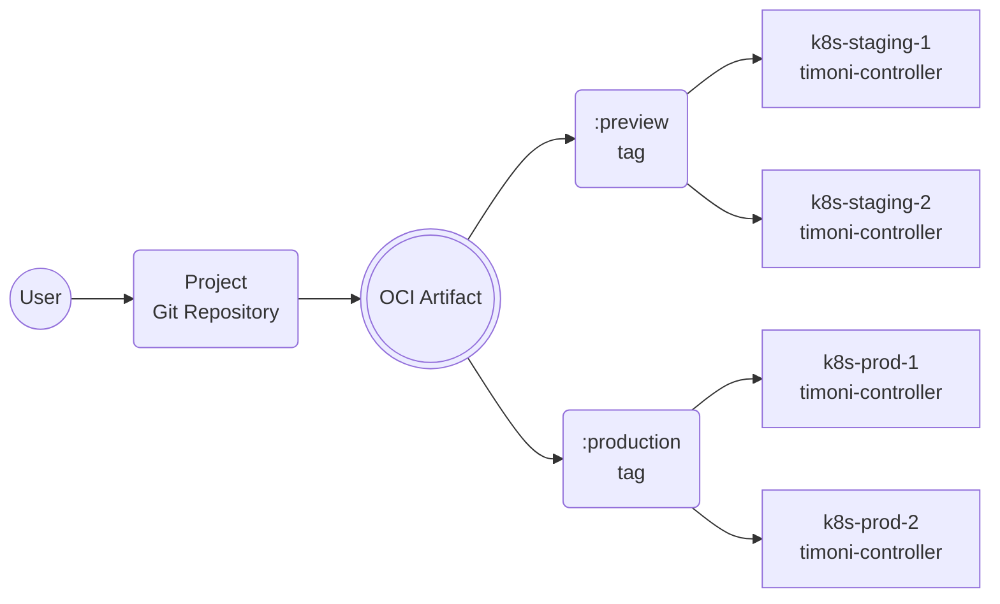

# Timoni Project Specifications

A Timoni Project is a collection of Bundles that are automatically deployed to a fleet of Kubernetes clusters.
The Project's source code can be versioned in a Git repository and must be published to a container registry.

Clusters that are running the Timoni controller can subscribe to a Project using a Kubernetes custom resource
that contains the Project's container registry URL and the artifact tag. 



A Timoni Project is a self-contained unit that describes how one or more applications
are configured and deployed to each Kubernetes cluster or group of clusters. Changes to an application's
configuration, that are published to a container registry, will be automatically applied to the target clusters.
Promoting changes from one environment to another can be done by tagging an artifact digest with a tag name
watched by a group of clusters.

## Project custom resource

```yaml
apiVersion: projects.timoni.sh/v1alpha1
kind: Project
metadata:
  name: my-project
  namespace: my-project-ns
  annotations:
    runtime.timoni.sh/cluster: "k8s-prod-1"
spec:
  serviceAccountName: "my-project-sa"
  source:
    repository: "oci://my-registry/my-project"
    tag: "production"
    path: "./my-project.cue"
```

The `.spec.serviceAccountName` has a dual purpose:

- It is used to attach image pull secrets for the project's repository and for all the modules' repositories.
- It is used for impersonation by the controller to perform operations on the cluster, thus ensuring tenant isolation.

The `.spec.source` is used to fetch the OCI artifact from the container registry that contains
the project's CUE definition and all the bundle and runtime files referenced by it.

The `runtime.timoni.sh` annotations can be used to set runtime values that are automatically injected
into the project's bundles. Thus enabling the same project to be deployed to multiple clusters while
using different values for each cluster.

## Project structure

The project's source code can be versioned in a Git repository and can be structured in various ways.

Example:

```sh
├── my-app
│   ├── bundle.cue 
│   └── runtime.cue
├── my-infra
│   ├── bundle.cue 
│   └── runtime.cue
└── my-project.cue
```

The contents of the Git repository are packaged as an OCI artifact and pushed to a container registry
using the `timoni project push` command. From there, the controller will fetch the artifact and
deploy the project to the cluster.

Multiple projects can be stored in the same repository, and each project can
be deployed to multiple clusters.
For each target cluster, the project's bundles can contain different config values
specific to that cluster or to its group of clusters.
The runtime definitions allow bundles to use dynamic config values extracted from
the target cluster, such as exiting Secrets, ConfigMaps and even custom resources.

The `my-project.cue` file is the project's CUE definition, and it references the bundle and runtime files:

```cue
project: {
	apiVersion: "v1alpha1"
	name:       "my-project"
	components: {
		"my-app": {
			bundle: ["./my-app/bundle.cue"]
			runtime: ["./my-app/runtime.cue"]
			needs: ["my-infra"]
		}
		"my-infra": {
			bundle: ["./my-infra/bundle.cue"]
			runtime: ["./my-infra/runtime.cue"]
		}
	}
}

```

The controller will reconcile the project's components by applying
the bundles using their corresponding runtime definitions.
By default, the controller will reconcile the components in parallel.
The `needs` field can be used to define dependencies between components
and thus control the order in which the bundles are applied.

## Project bootstrap

To streamline the onboarding of Projects onto Kubernetes clusters,
the Timoni CLI provides a `timoni project bootstrap` command.

```shell
timoni project bootstrap my-project.cue \
  --repository oci://my-registry/my-project \
  --repository-creds $DOCKER_USER:$DOCKER_TOKEN \
  --tag production \
  --push-artifact true \
  --cluster-name k8s-prod-1 \
  --namespace my-project-ns \
  --service-account my-project-sa \
  --service-account-role admin
```
