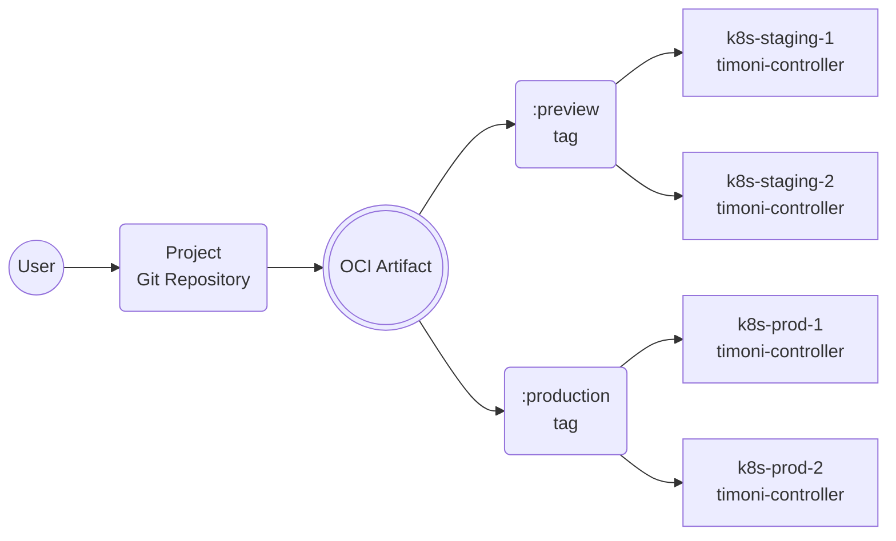
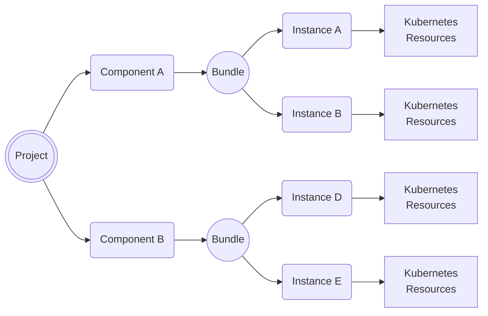

# Timoni Project Specifications

A Timoni Project is a collection of Bundles that are automatically deployed to a fleet of Kubernetes clusters.
The Project's source code can be versioned in a Git repository and must be published to a container registry.

Clusters that are running the Timoni controller can subscribe to a Project using a Kubernetes custom resource
that contains the Project's container registry URL and the artifact tag. 



A Timoni Project is a self-contained unit that describes how one or more applications
are configured and deployed to each Kubernetes cluster or group of clusters. Changes to an application's
configuration, that are published to a container registry, will be automatically applied to the target clusters.
Promoting changes from one environment to another can be done by tagging an artifact digest with a tag name
watched by a group of clusters.

## Project custom resource

```yaml
apiVersion: projects.timoni.sh/v1alpha1
kind: Project
metadata:
  name: my-project
  namespace: my-project-ns
  annotations:
    runtime.timoni.sh/cluster: "k8s-prod-1"
    runtime.timoni.sh/group: "production"
spec:
  serviceAccountName: "my-project-sa"
  source:
    repository: "oci://my-registry/my-project"
    tag: "production"
    path: "project.cue"
```

The `.spec.serviceAccountName` has a dual purpose:

- It is used to attach image pull secrets for the Project's repository and for all the modules' repositories.
- It is used for impersonation by the controller to perform operations on the cluster, thus ensuring tenant isolation.

The `.spec.source` is used to fetch the OCI artifact from the container registry that contains
the Project's CUE definition and all the bundle and runtime files referenced by it.

The `runtime.timoni.sh` annotations can be used to set runtime values that are automatically injected
into the Project's bundles. Thus enabling the same Project to be deployed to multiple clusters while
using different values for each cluster.

## Project structure

The Project's source code can be versioned in a Git repository and can be structured in various ways.

Example:

```sh
├── my-app
│   ├── bundle.cue 
│   └── runtime.cue
├── my-infra
│   ├── bundle.cue 
│   └── runtime.cue
└── project.cue
```

The contents of the Git repository are packaged as an OCI artifact and pushed to a container registry
using the `timoni project push` command. From there, the controller will fetch the artifact and
deploy the Project to the cluster.

Multiple Projects can be stored in the same repository, and each Project can
be deployed to multiple clusters.
For each target cluster, the Project's bundles can contain different config values
specific to that cluster or to its group of clusters.
The runtime definitions allow bundles to use dynamic config values extracted from
the target cluster, such as exiting Secrets, ConfigMaps and even custom resources.

## Project definition

The Project's CUE definition contains a list of components that point to the Bundle and Runtime files.

Example:

```cue
project: {
	apiVersion: "v1alpha1"
	name:       "my-project"
	components: {
		"my-app": {
			bundle: ["./my-app/bundle.cue"]
			runtime: ["./my-app/runtime.cue"]
			needs: ["my-infra"]
		}
		"my-infra": {
			bundle: ["./my-infra/bundle.cue"]
			runtime: ["./my-infra/runtime.cue"]
		}
	}
}

```

The controller will reconcile the Project's components by applying
the Bundles using their corresponding Runtime definitions.
By default, the controller will reconcile the components in parallel.
The `needs` field can be used to define dependencies between components
and thus control the order in which the bundles are applied.

The `runtime` field is optional, when not specified, the controller will 
inject the annotations values from the Project's custom resource into the Bundle.

Example of a Bundle that uses the annotations values from the Project's custom resource:

```cue
bundle: {
	_cluster: {
		name:  string @timoni(runtime:string:TIMONI_CLUSTER_NAME)
		group: string @timoni(runtime:string:TIMONI_CLUSTER_GROUP)
	}

	apiVersion: "v1alpha1"
	name:       "my-app"
	instances: {
		podinfo: {
			module: url: "oci://ghcr.io/stefanprodan/modules/podinfo"
			namespace: "my-project-ns"
			values: {
				if _cluster.group == "staging" {
					replicas: 1
				}
				if _cluster.group == "production" {
					replicas: 2
				}
			}
		}
	}
}

```

## Project bootstrap

To streamline the onboarding of Projects onto Kubernetes clusters,
the Timoni CLI provides a `timoni project bootstrap` command.

Example:

```shell
timoni project bootstrap my-Project.cue \
  --repository oci://my-registry/my-Project \
  --repository-creds $DOCKER_USER:$DOCKER_TOKEN \
  --tag production \
  --push-artifact true \
  --cluster-name k8s-prod-1 \
  --cluster-group production \
  --namespace my-Project-ns \
  --service-account my-Project-sa \
  --service-account-role admin
```

If the target cluster is not running the Timoni controller, the bootstrap command will
prompt the user to confirm the installation of the controller in the `timoni-system` namespace.
After the controller installation is complete,
the bootstrap command will create the Project's namespace, image pull secret, custom resource,
service account and role binding.

## Project reconciliation

The reconciliation of a Project consists of the following operations:

- Reads the image pull secrets attached to the Project's service account.
- Connects to the container registry using the credentials from the image pull secrets.
- If no secrets are found, the controller will use Kubernetes Workload Identity
  to authenticate to the container registry.
- Fetches the artifact metadata (OCI manifest) for the specified tag from the container registry.
- Downloads the OCI artifact layers if they are not already cached.
- Extracts the OCI artifact contents to a temporary directory.
- Reads the Project's CUE definition and validates the files referenced by each component.
- Determines the parallelization factor and the order in which the components will be reconciled.
- Starts the reconciliation of each component in parallel.
- When all components are reconciled, an event is emitted, and the Project's Status is updated to reflect
  the overall result.



 The reconciliation of a component consists of the following operations:

- Loads the values from the Runtime definitions and injects them into the Bundle.
- Downloads (if not cached) the Modules referenced by the Bundle using
  the image pull secrets to authenticate to the container registry.
- Applies the Bundle's Instances in order one-by-one.
- Waits for each Instance to be rolled out and healthy before applying the next Instance.
- If the reconciliation fails, the controller will retry the operation using a configurable exponential backoff.
- When an Instance apply finishes, a Kubernetes event is emitted. The event contains the list of
  applied resources, the error message if the Instance apply failed, the module version,
  and the time it took to apply the Instance.
- When the component reconciliation finishes, it's status is reflected in the Project's Status.

## Project commands

The Timoni CLI provides a set of commands to manage Projects:

- `timoni project bootstrap` - bootstraps a Project onto a Kubernetes cluster.
- `timoni project push` - builds and pushes a Project to a container registry.
- `timoni project reconcile` - triggers the reconciliation of a Project with an annotation.
- `timoni project suspend` - suspends the reconciliation of a Project with an annotation.
- `timoni project resume` - resumes the reconciliation of a Project with an annotation.
- `timoni project delete` - deletes a Project from a Kubernetes cluster.

The Timoni CLI provides a set of commands to inspect Projects:

- `timoni project list` - lists the Projects and their last reconcile status.
- `timoni project status` - prints the Project's status with details about each component.
- `timoni project events` - prints all the events related to a Project.
